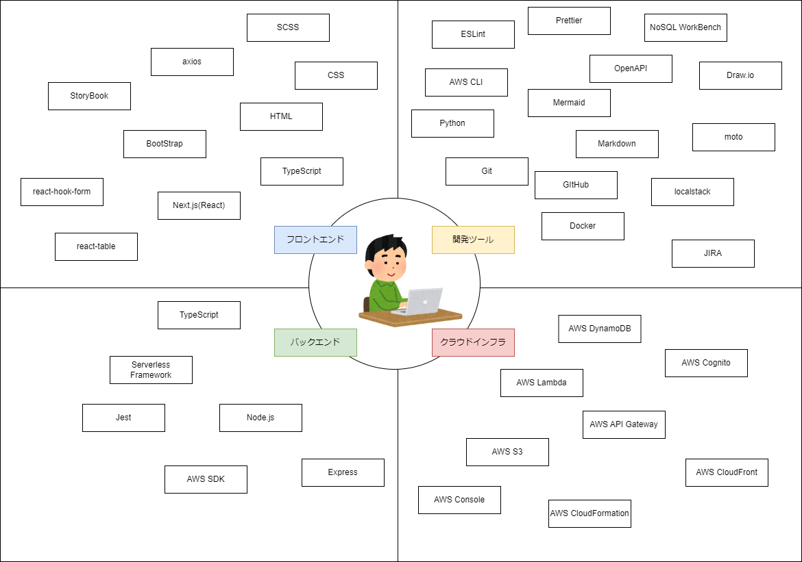

# 名前
ECSiteアプリ

# 説明
このアプリを作る中で、以下のスキルセットがざっくり身につきました。

 
## フロントエンド
  |カテゴリ|名称|説明|備考|
  |--|--|--|--|
  |言語|HTML|ウェブページの構造を定義するために使用される標準マークアップ言語||
  |言語|CSS|ウェブページのフォーマットとレイアウトを指定するスタイルシート言語||
  |言語|SCSS|CSSの機能を拡張したプリプロセッサで、変数、ネスト、ミックスインなどの機能を提供||
  |言語|TypeScript|型宣言可能なJavaScriptの上位互換言語||
  |フレームワーク|Next.js|サーバーサイドレンダリングや静的サイト生成をサポートするReactベースのフレームワーク||
  |フレームワーク|BootStrap|HTML、CSS、JavaScriptを用いたレスポンシブなウェブデザインを簡単に実装できるフロントエンドフレームワーク||
  |ライブラリ|axios|ブラウザとNode.jsの両方で動作するPromiseベースのHTTPクライアント||
  |ライブラリ|react-hook-form|効率的なフォーム検証と状態管理を提供するReact用の軽量フォームライブラリ||
  |ライブラリ|react-table|Reactでデータを扱うための軽量でフレキシブルなテーブルライブラリ||
  |ツール|StoryBook|UIコンポーネントを隔離して開発し、カタログ化するためのオープンソースの開発環境||

## バックエンド
  |カテゴリ|名称|説明|備考|
  |--|--|--|--|
  |言語|TypeScript|型宣言可能なJavaScriptのスーパーセット||
  |実行環境|Node.js|サーバーサイドでJavaScriptを実行するための非同期イベント駆動型のJavaScriptランタイム||
  |ライブラリ|express|APIの構築やウェブサービスの実装に広く使われているNode.js上で動作する軽量で柔軟なウェブアプリケーション||
  |ライブラリ|AWS SDK|Amazon Web Servicesの各種サービスをプログラム的に操作するためのソフトウェア開発キット||
  |ライブラリ|Jest|JavaScriptのテストフレームワークで、特にReactやNode.jsのプロジェクトでのユニットテストに適している||
  |ツール|Serverless Framework|AWS LambdaなどのFaaS（Function as a Service）プロバイダーを利用してサーバーレスアプリケーションを構築、デプロイするためのIacツール||

## クラウドインフラ
  |カテゴリ|名称|説明|備考|
  |--|--|--|--|
  |インフラ|AWS|Amazonが運営するクラウドサービスプラットフォーム||

## 開発ツール
  |カテゴリ|名称|説明|備考|
  |--|--|--|--|
  |管理|Git|変更履歴を記録・追跡するための分散型バージョン管理システム||
  |ツール|Docker|コンテナを利用した仮想化ツール||

# デモ
アプリのデモサイト(AWSで稼働しています)。
  - https://d3g1t7tx4q2vwo.cloudfront.net/

  - お試し用アカウント
    - 所有者
      - Owner1
      - ayas88888+Owner1@gmail.com
      - Bf12Asf123

    - 顧客
      - Customer1
      - ayas88888+Customer1@gmail.com
      - Bf12Asf123

# 前提条件
アプリを開発するために必要だった最低限のソフトウェアです。

## Windows
Windows10で開発しました。それ以外のOSでは動作未確認です。

## node.js
JavaScriptのサーバーサイドランタイム環境です。
v20で開発しました。
  - https://nodejs.org/en/download

## docker desktop
コンテナを利用した仮想化ツールです。
ローカルPCでの開発に利用しました。
  - https://www.docker.com/ja-jp/products/docker-desktop/

## aws cli
AWSのリソースを操作するためのコマンドラインプログラムです。
 - https://aws.amazon.com/jp/cli/

## python
環境構築及び動作確認用のスクリプトを作成するときにpythonを利用しました。
  - https://www.python.org/downloads/

## NoSQL Workbench
AWS DynamoDBのテーブル設計で利用しました。
  - https://docs.aws.amazon.com/ja_jp/amazondynamodb/latest/developerguide/workbench.settingup.html

# インストール
アプリのインストール手順です。ローカルPCで動かす場合とAWSにホスティングする場合の2ケースあります。

## ローカルPC
### フロントエンド
  - インストール
    1. cd app/front/
    2. npm i

  - 起動
    1. cd app/front/
    2. npm run local

### バックエンド
  - インストール
    1. cd app/back/
    2. npm i

  - AWSスタブ群の起動
    1. cd tool
    2. docker compose up -d
    3. python t.py seed

  - アプリ起動
    1. cd app/back/
    2. npm run local

  - お試し用アカウントの登録
    1. cd tool
    2. python t.py req userReg

## AWS
AWSへのホスティングは、AWSアカウントを作成し、かつPCにAWSの認証情報を事前に設定する必要がありました。
  - https://aws.amazon.com/jp/register-flow/
  - https://docs.aws.amazon.com/ja_jp/cli/latest/userguide/cli-configure-files.html

### フロントエンド
  - 初回のみ実行(コンテンツ格納用S3バケットやCloudFront(CDN)のセットアップ)。
    1. cd app/front/
    2. npm run cfn
    3. コンテンツ格納用S3バケットの物理IDを転記.
      - 実行したスタックのステータスが"CREATE_COMPLETE"となることを確認
      - リソースタブに移動
      - 論理ID"NextJS"に該当する物理IDをコピーし、"s3://{物理ID}"の形式に加工.
      - 下記値を"s3://{物理ID}"で更新.
        - app/front/package.json > config > s3buket

  - 毎回
    1. cd app/front/
    2. npm i
    3. npm run deploy

### バックエンド
  1. cd app/back/
  2. npm run deploy

# 備忘録
## バックログ
### テンプレート
  - ユーザーストーリー
  - 受け入れ基準
  - タスク
  - 参考情報

### チケット化したいアイテム
  - 固定ドメインを割り当てる。
  - 画像ファイル格納用S3バケットの定期クリーニングバッチの作成。
  - dockerのCPU使用率が100%から回復しない問題の対策。
  - roleによるバックエンドAPIの機能利用制限

## git
  - リモートブランチの新規作成
    - git switch -c ECSITE-40
    - git push -u origin ECSITE-40

  - リモートブランチへのプッシュ
    - git status
    - git add .
    - git commit -m "ECSITE-40 ドキュメント群を整備する。"
    - git push origin ECSITE-40

## docker
  - WSLのシャットダウン
    - wsl --shutdown
    - ※再起動はDokcerDesktopをスタートさせる。

  - 仮想ストレージ領域の最適化
    - diskpart
    - select vdisk file="C:\Users\ss7wp\AppData\Local\Docker\wsl\data\ext4.vhdx"
    - attach vdisk readonly
    - compact vdisk
    - detach vdisk
    - exit

  - 参考サイト 
    - Dockerを使っていたらPC容量が枯渇したので対処した（ext4.vhdxの最適化）
      - https://qiita.com/msymacromill/items/282a2212b93380511437

## node.js
  - グローバルインストールのNPM一覧表示
    - npm list -g

  - devDependenciesにインストールするコマンド
    - npm install --save-dev {パッケージ名}
    - npm install --save-dev @storybook/addon-mdx-gfm

  - アンインストールコマンド
    - npm uninstall {パッケージ名}
    - npm uninstall @storybook/addon-mdx-gfm

  - 再インストール
    - rm -rf node_modules package-lock.json
    - npm install

  - パッケージのアップデート
    - npm install {パッケージ名}@latest
    - npm update {パッケージ名}
    - npm update @storybook/testing-library
    - npm install @storybook/addons@latest

  - アップデートが利用可能なパッケージのみを表示
    - npm outdated

  - Next.js(TypeScirpt)セットアップ手順
    1. npx create-next-app testApp
    2. cd testApp
    3. npm install --save-dev typescript @types/react @types/node
    4. touch tsconfig.json
    5. npm run dev
    6. .js ファイルを .tsx に変更

## AWS
  - localhost内のスタブ構成
    - APIGateway + Lambda
      - ServerlessFramework local
    - DynamoDB
      - DynamoDB Local(NoSQL Workbenchに同梱)
    - S3
      - localstack
    - Cognito
      - moto(localstackはPro(有償版)しかCognitoを利用できない)。
  
  - 参考サイト 
    - CloudFormationテンプレートの構造分析
      - https://docs.aws.amazon.com/ja_jp/AWSCloudFormation/latest/UserGuide/template-anatomy.html

    - Amazon S3 から HTTP 307 Temporary Redirect レスポンスが返されるのはなぜですか?
      - https://repost.aws/ja/knowledge-center/s3-http-307-response

    - クライアントからS3に署名付きURLでアップロードする
      - https://r-tech14.com/pre-signed-url-upload/

    - DynamoDB テーブルのデータモデリング
      - https://docs.aws.amazon.com/ja_jp/amazondynamodb/latest/developerguide/data-modeling.html
    
    - DynamoDB をオンラインショップのデータストアとして使用する
      - https://docs.aws.amazon.com/ja_jp/amazondynamodb/latest/developerguide/data-modeling-online-shop.html

  - DynamoDB の設計について考えてみる。
    - https://qiita.com/_kensh/items/2351096e6c3bf431ff6f

## BootStrap
  - 参考サイト
    - サンプル
      - https://getbootstrap.jp/docs/5.3/examples/

    - スペーシング
      - https://getbootstrap.jp/docs/5.3/utilities/spacing/

## Mermind
  - 参考サイト
    - ダイアグラムの構文
      - https://mermaid.js.org/intro/syntax-reference.html

## Windows
  - 参考サイト
    - ポートオープン確認
      - netstat -an | findstr :{port number}

## StoryBook
  - 参考サイト
    - Nextjsプロジェクトにstorybookを導入する場合に発生するModule not found対応
      - https://qiita.com/sinnlosses/items/51e614570180c5f12e86

## Jest
  - 参考サイト
    - Jest テストは Github Action では失敗しますが、ローカルでは成功します
      - https://github.com/jestjs/jest/issues/11430

## READMEの書き方
  - 参考サイト
    - https://www.makeareadme.com/
    - https://github.com/matiassingers/awesome-readme

## 便利サイト
  - 任意サイズのダミー画像生成
    - https://placehold.jp/
